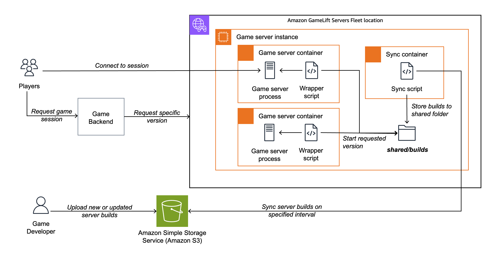

# Amazon GameLift Servers Multi-build Container Fleets

This solution provides a flexible container-based deployment for Amazon GameLift Servers, which supports running multiple game server build vesrions on a single fleet. Instead of baking game server binaries into container images, builds are stored in S3 and synced automatically to Amazon GameLift Servers instances.

The solution also comes with a deployment pipeline utilizing AWS CodeBuild to setup your fleet, and tools to manage the game server builds in Amazon S3. Game server binaries don't need to integrate with the Amazon GameLift Server SDK, as that is managed by a wrapper Go process that launches game server processes based on the requested version. 

**IMPORTANT DISCLAIMER:** While this solution has been extensively tested, it's provided as a guidance only and you will need to validate it for your own needs. You are also fully responsible for any production environments using any parts of this solution.

**RECOMMENDED USE:** The solution works best for development, test, and alpha/beta use cases. For production use, the 0.125vCPU/512MB resource utilization of the S3 data syncing can be a cost consideration. In addition, you might want to have production fleets in a more static setup to avoid accidental changes.

## Key Features

- **Dynamic Build Loading**: Game server binaries stored in S3, not in container images
- **Multiple Build Versions**: Support multiple game server versions simultaneously on the same fleet
- **Version Selection**: Specify build version per game session request
- **Per-Instance Container for Build Management**: Dedicated container syncs builds from S3 to shared volume
- **Zero Downtime Updates**: Deploy new builds without rebuilding containers or updating fleets
- **Automated Deployment**: CloudFormation and CodeBuild handle infrastructure and container builds
- **Build Integrity Verification**: Upload/download completion markers prevent incomplete builds from being used
- **Interactive CLI Tool**: Manage builds with an easy-to-use menu-driven interface

## Architecture Overview

The solution utilizes two different container images:

1. **Game Server Container**: Runs an Amazon GameLift Servers SDK wrapper (Go application) and the game server process. Amazon GameLift Servers will run as many copies of this as it can fit on the instance (3 when using defaults).
2. **S3 Sync Container** (per-instance): Continuously syncs game builds from S3 to a shared volume. Full sync only done when the `.builds_updated` file has changed in S3 to avoid extensive amounts of unneeded API calls.

Both containers share a volume mounted at `/shared/builds` where game server binaries are stored and accessed.

### Resource Allocation

The solution is configured for a **c6i.xlarge** instance (4 vCPU, 8GB RAM) with the following resource allocation:

**Per-Instance S3 Sync Container:**
- 0.125 vCPU, 512 MB memory 
- Runs continuously to sync builds from S3

**Game Server Containers (3 per instance):**
- 1.25 vCPU per session, 2300 MB memory per session
- Remaining resources after accounting for GameLift's supporting tooling overhead and sync container

This allocation allows three concurrent game sessions per instance while ensuring the S3 sync container has sufficient memory to handle large builds with thousands of files without running out of memory.

### Game Server Container Flow

1. **Container Standby**: Game server container starts and waits indefinitely for game session allocation
2. **Session Request**: Game session request arrives with build version in `GameProperties["BuildVersion"]`
3. **Version Extraction**: Go SDK wrapper extracts build version from GameProperties and writes it to `/tmp/build_version.txt` locally on the container
4. **Build Availability Check**: Wrapper script reads the build version and checks if the build is available in `/shared/builds/<version>/`
5. **Wait for Sync**: If not available, wrapper waits for S3 sync container to download it (up to 30 seconds)
6. **Integrity Verification**: Wrapper waits for `.download_complete` marker to ensure build is fully synced (up to 30 seconds)
7. **Server Start**: Wrapper starts the game server binary from the versioned directory in background
8. **Activation Delay**: Wrapper verifies server process is running
9. **Session Activation**: Wrapper signals Go SDK to activate the game session via `/tmp/activate_session.txt`
10. **Game Session**: Game server runs and handles the session (GameSessionData is available for your game logic over a localhost endpoint if needed)
11. **Cleanup**: On termination, wrapper signals SDK to call `ProcessEnding()` and cleans up temp files. This will trigger the creation of a new game server container

### Architecture diagram



Please refer to [Amazon GameLift Containers Starter Kit](https://github.com/aws/amazon-gamelift-toolkit/tree/main/containers-starter-kit) to see the deployment pipeline architecture. This solution uses a similar CodePipeline-based setup, with the differentiation that the game build itself is not packaged as part of the deployment.

## Quick Start

### Step 1: Clone the Repository

Clone this repository and navigate to the solution folder:

```bash
git clone https://github.com/aws/amazon-gamelift-toolkit.git
cd amazon-gamelift-toolkit/multi-build-solution/
```

Open the `multi-build-solution` folder in your favorite IDE or editor.

### Step 2: Prerequisites

**Local Requirements:**
- [AWS CLI](https://docs.aws.amazon.com/cli/latest/userguide/getting-started-install.html) configured with appropriate credentials
- Default AWS Region set to a [region that is supported as a home region for a fleet](https://docs.aws.amazon.com/gamelift/latest/developerguide/gamelift-regions.html)
- IAM permissions to create the resources listed below
- Game server Linux build

**IAM Permissions Needed:**
Your AWS user/role needs permissions to create:
- AWS CloudFormation stacks
- Amazon GameLift fleets and container groups
- Amazon ECR repositories
- Amazon S3 buckets
- AWS CodeBuild projects
- AWS IAM roles and policies
- Amazon CloudWatch log groups

**Useful Resources:**
- [AWS CLI Configuration Guide](https://docs.aws.amazon.com/cli/latest/userguide/cli-configure-quickstart.html)
- [GameLift Container Fleets Documentation](https://docs.aws.amazon.com/gamelift/latest/developerguide/containers-intro.html)
- [GameLift Supported Regions](https://docs.aws.amazon.com/gamelift/latest/developerguide/gamelift-regions.html)

### Step 3: Configure Your Binary Path

Before deploying, you need to configure the path to your game server binary in `wrapper.sh`. This path must be consistent across all build versions.

**Edit `wrapper.sh` and set:**
```bash
SERVER_BINARY_RELATIVE_PATH="gameserver"  # Change this to match your binary location
```

**Examples:**

```
# Simple binary at root (default test server included that's just a blocking shell script)
game-builds/v1.0.0/
└── gameserver              # Path: "gameserver"

# Unreal Engine
game-builds/v1.0.0/
└── MyGame/
    └── Binaries/
        └── Linux/
            └── MyGameServer    # Path: "MyGame/Binaries/Linux/MyGameServer"

# Unity
game-builds/v1.0.0/
├── MyGame.x86_64           # Path: "MyGame.x86_64"
└── MyGame_Data/

```

**Important:** All your build versions must use the same relative path structure. If you change the path, you'll need to update `wrapper.sh` and redeploy the infrastructure with the setup-fleet scripts.

---

### Step 4: Deploy Infrastructure

**Linux/macOS:**
```bash
./setup-fleet.sh MyStackName
```

**Windows (PowerShell):**
```powershell
.\setup-fleet.ps1 MyStackName
```

The script will prompt you for the `ServerBinaryRelativePath` (the path to your game server binary within build folders). You can press Enter to use what you configured above, or enter your custom path like `"MyGame/Binaries/Linux/MyGameServer"`.

This script will:
- Deploy the CloudFormation stack with default settings (port 7777/UDP). This includes an Amazon GameLift Servers fleet with one location, the CodeBuild project, Amazon S3 bucket for files, and other supporting resources.
- Create and upload a zip file with the game server wrapper and sync scripts
- Trigger CodeBuild to build and deploy containers to the fleet
- Provide information on checking the status of the deployment

The deployment takes about 10-15 minutes. You can use the CLI commands provided on your terminal to check the progress of the CodeBuild Project and the fleet. You can also check the Outputs from the AWS CloudFormation console to view the CodeBuild project logs in realtime, and once that's done, open the Amazon GameLift Servers console to view the fleet deployment.

**NOTE:** This deployment takes some time as there are multiple build and deployment steps. Once the fleet is active, you can easily expand it to more locations and scale it out. New game server versions are deployment through Amazon S3 so you usually don't need to run this setup step again.

**Customizing Parameters:**

The automated script uses default CloudFormation parameters. To customize settings like port, protocol, or instance type:

1. **Edit the CloudFormation template parameters** in `fleet_deployment_pipeline.yml` before running the script, OR
2. **Use the manual setup** below for full control over all parameters

**Common customizations:**
- **Port**: Default is `7777`. If your game server uses a different internal port, update the `Port` parameter in the template **AND** the `wrapper.sh` script. Note: Public ports of the EC2 instance are automatically mapped to the private ports, so you don't need to have different ports for different game servers on the same instance.
- **Protocol**: Default is UDP. Change to TCP if needed and modify the fleet inbound permissions to allow TCP traffic. UDP traffic is allowed by default.
- **Instance Type**: Default is `c6i.xlarge`. Adjust based on your game server requirements. Make sure to set up the vCPU and memory settings as needed.

See the [Configuration section](#configuration) for more information

### Step 5: Upload Your Game Server Build

Use the interactive CLI tool to manage builds:

**Linux/macOS:**
```bash
./manage-builds.sh MyStackName
```

**Windows (PowerShell):**
```powershell
.\manage-builds.ps1 MyStackName
```

From the menu:
1. Select **"2) Upload a new build"**
2. Enter your build directory path (e.g., `./game-builds/v1.0.0`)
3. Enter a version identifier (e.g., `v1.0.0`)
4. Confirm the upload

The tool automatically:
- Fetches the S3 bucket from your CloudFormation stack
- Uploads your build to S3
- Creates completion markers for integrity verification
- updates the marker that indicates builds have been updated
- Shows you the command to create a game session

**Build Requirements:**
- Must contain the game server binary at the path specified in `ServerBinaryRelativePath` (default: "gameserver")
- Binary must be executable (chmod +x)
- Should include all dependencies needed to run

See `game-builds/README.md` for examples of different build structures (Unreal, Unity, custom).

### Step 6: Create a Game Session

**Linux/macOS:**
```bash
# Get your fleet ID (shown by setup script, or from CloudFormation outputs)
FLEET_ID=$(aws cloudformation describe-stacks --stack-name MyStackName \
  --query 'Stacks[0].Outputs[?OutputKey==`FleetId`].OutputValue' --output text)

# Create a game session with your build version
aws gamelift create-game-session \
  --fleet-id $FLEET_ID \
  --maximum-player-session-count 10 \
  --game-properties Key=BuildVersion,Value=v1.0.0
```

**Windows (PowerShell):**
```powershell
# Get your fleet ID (shown by setup script, or from CloudFormation outputs)
$FLEET_ID = aws cloudformation describe-stacks --stack-name MyStackName --query 'Stacks[0].Outputs[?OutputKey==`FleetId`].OutputValue' --output text

# Create a game session with your build version
aws gamelift create-game-session --fleet-id $FLEET_ID --maximum-player-session-count 10 --game-properties Key=BuildVersion,Value=v1.0.0
```

You'll receive an IP and port to connect your game client. You should check the "Game Sessions" tab in the AWS Management Console for your fleet to make sure the session activated correctly. If it's not showing up, check the CloudWatch Logs for your fleet to see the game server wrapper log output for individual containers.

### Step 7: Manage Builds

Use the CLI tool anytime to manage your builds:

**Linux/macOS:**
```bash
./manage-builds.sh MyStackName
```

**Windows (PowerShell):**
```powershell
.\manage-builds.ps1 MyStackName
```

Available operations:
- **List all builds** - View builds with status and size
- **Upload a new build** - Add a new version
- **Delete a build** - Remove old versions
- **Change stack** - Switch between different deployments

---

### Manual Setup (Advanced)

For more control over the deployment process, follow these manual steps.

#### 1. Deploy Infrastructure with CloudFormation

1. Open the **AWS CloudFormation console** and select **Create stack** -> **With new resources**
2. Select **Upload template** and upload the `fleet_deployment_pipeline.yml` file
3. Enter the **Stack Name** and configure parameters:
   - **Port**: Your game server port (default: 7777)
   - **Protocol**: UDP or TCP (default: UDP)
   - **S3BuildsPrefix**: S3 prefix for build versions (default: "builds/")
   - **SyncInterval**: How often to sync from S3 in seconds (default: 5)
   - **ContainerGroupName**: Name for your container group (default: "MyGame")
   - **FleetDescription**: Description for your fleet (default: "MyGameFleet")
   - **FleetInstanceType**: EC2 instance type (default: "c6i.xlarge")
   - **vCPULimit**: vCPU limit per game server container (default: 1.25)
   - **MemoryLimit**: Memory limit in MiB per game server container (default: 2300)
4. Acknowledge the creation of IAM resources and select **Submit**

The stack creates:
- S3 bucket for game server zip and build versions
- GameLift Container Fleet
- CodeBuild project for building and deploying containers
- IAM roles with appropriate permissions

#### 2. Configure Binary Path and Prepare Repository Zip

Edit `wrapper.sh` and set `SERVER_BINARY_RELATIVE_PATH` to match your binary location (see [examples](#important-configure-your-binary-path) above).

Then create a zip file containing the repository files:

```bash
# From the repository root
zip -r gameserver.zip . -x "*.git*" -x "game-builds/*" -x "*.md"
```

**Important**: The zip should contain files from the repository root (Dockerfile, wrapper.sh, SdkGoWrapper/, s3-sync-sidecar/, etc.). Don't include the game server files (ie. game-builds)!

#### 3. Upload Repository Zip and Build Containers

1. In CloudFormation console, select **Outputs** and note the **GameServerBuildBucketName**
2. Upload the repository zip:
   ```bash
   aws s3 cp gameserver.zip s3://YOUR-BUCKET-NAME/gameserver.zip
   ```
3. Open the **GameServerCodeBuildProject** link from CloudFormation outputs
4. Select **Start build** to build both containers and deploy them to the fleet

The CodeBuild project will:
- Build the Go SDK wrapper
- Build and push the game server container to ECR
- Build and push the S3 sync sidecar container to ECR
- Create/update the container group definitions (game server + per-instance sync)
- Deploy the container groups to your fleet

#### 4. Upload Your Game Server Build

Using the upload script:

**Linux/macOS:**
```bash
./upload-build.sh ./MyGameServer v1.0.0 YOUR-BUCKET-NAME
```

**Windows (PowerShell):**
```powershell
.\upload-build.ps1 .\MyGameServer v1.0.0 YOUR-BUCKET-NAME
```

## Configuration

### Wrapper Script Configuration

Edit `wrapper.sh` before creating the repository zip (or use `setup-fleet.sh` which prompts for this):
- `PORT`: Game server port (must match CloudFormation parameter)
- `SERVER_BINARY_RELATIVE_PATH`: Path to binary within build folders (default: "gameserver")

See the [binary path examples](#important-configure-your-binary-path) in the Quick Start section above.

### Updating Configuration

To update configuration after deployment:

1. Update CloudFormation stack parameters (if needed)
2. If you changed `SERVER_BINARY_RELATIVE_PATH` in `wrapper.sh`, recreate the zip
3. Upload new zip to S3
4. Trigger CodeBuild to rebuild containers

### Wrapper Script Timeouts

Edit `wrapper.sh` to adjust:
- timeouts: Max wait for build sync (default: 30s) and download complete (default: 30s)
- Server start verification: 2 second check after starting game server

Note: The wrapper waits indefinitely for game session allocation. Containers can remain in standby for extended periods and will terminate cleanly when GameLift sends the termination signal.

### S3 Sync Logic

The S3 sync container found in `s3-sync-sidecar/sync.sh` uses a marker file optimization to minimize S3 API calls:

**How it works:**
- A marker file (`.builds_updated`) is stored at the S3 bucket root
- The sync container checks this marker file every 5 seconds (configurable via `SYNC_INTERVAL`)
- Full sync only occurs when the marker file's ETag changes
- Upload scripts automatically update the marker after successful uploads

**Benefits:**
- Reduces S3 API calls to just marker checks + occasional syncs
- Marker checks use HEAD requests (cheaper than LIST operations)
- Full sync only happens when builds actually change
- Saves significant S3 API costs for fleets with many instances

**Configuration:**
- `SYNC_INTERVAL`: How often to check marker file (default: 5 seconds)

The marker file is automatically managed by upload scripts.

## S3 Build Structure

Each build version should have a consistent structure with the game server binary at a predictable location:

```
s3://your-bucket/builds/
├── v1.0.0/
│   ├── gameserver          # Or your configured binary path
│   ├── .upload_complete    # Integrity marker
│   └── [game files]
├── v1.1.0/
│   ├── gameserver
│   ├── .upload_complete
│   └── [game files]
└── default/
    ├── gameserver
    ├── .upload_complete
    └── [game files]
```

**Important**: All build versions must use the same relative path structure as configured in the `ServerBinaryRelativePath` CloudFormation parameter. See the [binary path examples](#important-configure-your-binary-path) in the Quick Start section for different game engine structures.

### Storage Limits

GameLift instances have a **54GB storage limit**. The build manager CLI tracks total storage usage and warns you when approaching this limit:

- **Green**: Under 30GB - plenty of space
- **Yellow**: 30-40GB - monitor usage
- **Red**: Over 40GB - delete old builds soon

Use `./manage-builds.sh` to list builds with total storage, and delete old versions to stay under the limit. The sync container downloads all builds to `/shared/builds`, so the total of all your build versions must fit within 54GB.

**Best Practices:**
- Keep 2-3 recent versions for rollback capability
- Delete old builds regularly
- Optimize build size for faster sync times

## Troubleshooting

**Build not found:**
- Verify build exists in S3: `./manage-builds.sh YourStackName` or directly from S3
- Check build has `.upload_complete` marker
- Review S3 sync container logs by logging into the instance under Instances tab (you need to run `sudo su` to access standard Docker commands like `docker ps` and `docker logs <containerid>`. Navigate to the `/shared/builds/` folder to see the status of synced build files)
- Ensure version name matches exactly (case-sensitive)

**Game server won't start:**
- Check if binary path matches `ServerBinaryRelativePath` parameter
- Ensure the game server binary is executable (chmod +x)
- Check for missing dependencies in build directory
- Review game server container logs in CloudWatch Logs

**Session activation timeout:**
- Check if server crashes immediately after start
- Review wrapper logs for "Game server process failed to start"

**Incomplete build errors:**
- Wait for upload to complete before creating sessions
- Check for `.upload_complete` marker in S3
- Verify `.download_complete` marker appears on instance
- Review sync container logs for download errors

## Cleanup

To completely remove the deployment and avoid ongoing charges, follow this guide.

### 1. Empty the S3 Bucket

The S3 bucket must be empty before CloudFormation can delete it. You can empty it using the AWS Management Console or CLI:

**Using AWS Management Console:**
1. Open the [S3 Console](https://console.aws.amazon.com/s3/)
2. Find your bucket (name is in CloudFormation outputs: `GameServerBuildBucketName`)
3. Select the bucket and click **Empty**
4. Confirm by typing "permanently delete" and click **Empty**

**Using AWS CLI:**
```bash
# Get bucket name from CloudFormation
BUCKET_NAME=$(aws cloudformation describe-stacks --stack-name MyStackName \
  --query 'Stacks[0].Outputs[?OutputKey==`GameServerBuildBucketName`].OutputValue' --output text)

# Empty the bucket (removes all objects and versions)
aws s3 rm s3://$BUCKET_NAME --recursive

# If versioning is enabled, also delete all versions
aws s3api delete-objects --bucket $BUCKET_NAME \
  --delete "$(aws s3api list-object-versions --bucket $BUCKET_NAME \
  --query '{Objects: Versions[].{Key:Key,VersionId:VersionId}}' --output json)"
```

### 2. Delete the CloudFormation Stack

**Using AWS Management Console:**
1. Open the [CloudFormation Console](https://console.aws.amazon.com/cloudformation/)
2. Select your stack (e.g., `MyStackName`)
3. Click **Delete**
4. Confirm the deletion

**Using AWS CLI:**
```bash
aws cloudformation delete-stack --stack-name MyStackName

# Wait for deletion to complete (optional)
aws cloudformation wait stack-delete-complete --stack-name MyStackName
```

**Note:** If stack deletion fails, check the CloudFormation events for errors. Common issues include non-empty S3 buckets or resources created outside CloudFormation that depend on stack resources.

## Original Baseline

This solution is based on the [Amazon GameLift Containers Starter Kit](https://github.com/aws/amazon-gamelift-toolkit/tree/main/containers-starter-kit). The original approach baked game server binaries into container images. This version adds dynamic loading from S3 for greater flexibility.

## License

This library is licensed under the MIT-0 License. See the LICENSE file.